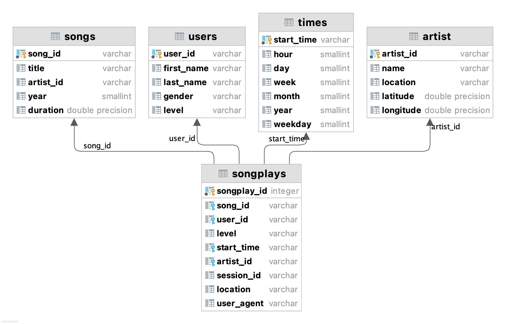

# ETL process

## Project description
This projects creates a ETL process with data files about music stream

## Database design
### Fact table
songplays
### Dim table

## ETL Process
Extract, transform, load processes in etl.py populate the songs and artists tables with data derived from the JSON song files, data/song_data. Processed data derived from the JSON log files, data/log_data, is used to populate time and users tables. A SELECT query collects song and artist id from the songs and artists tables and combines this with log file derived data to populate the songplays fact table.

## How to run
run python script `etl.py`
test data on `test.ipynb`

## Structure
### etl.py
python script to ETL data to the tables on postgreSQL
### test.ipynb
a notebook document for the test run
